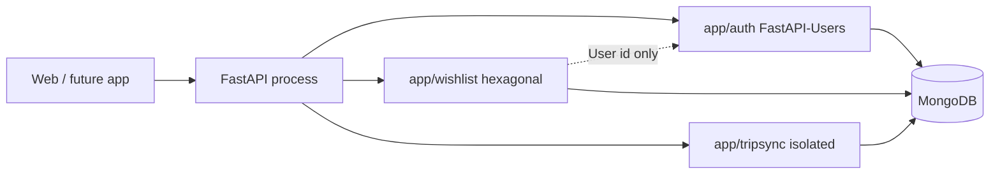
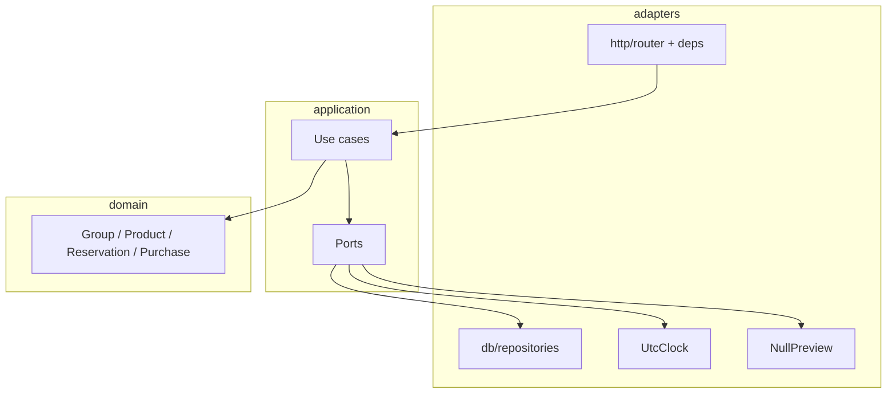
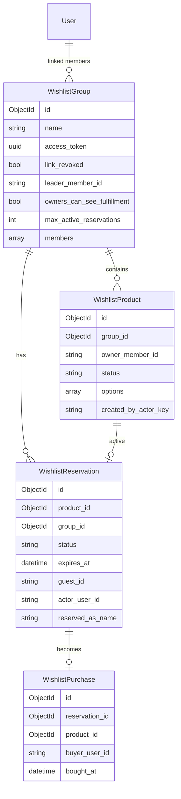
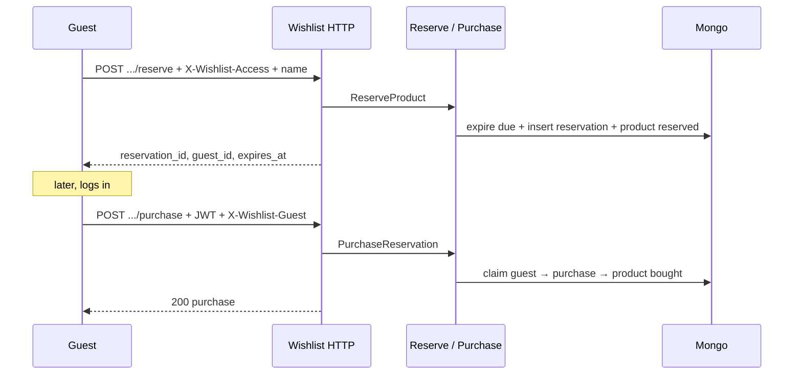
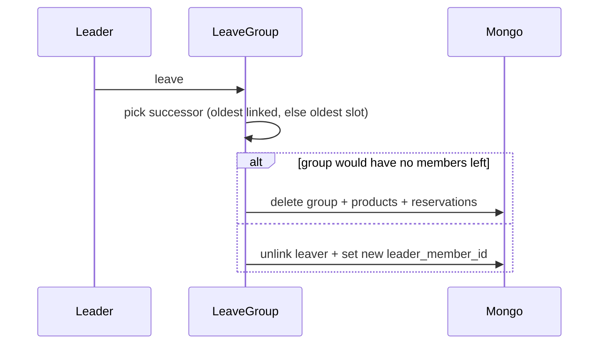

# Wishlist — Product requirements, HLD, LLD

| | |
|--|--|
| Status | Approved for implementation (v1) |
| Code name | Wishlist |
| API prefix | `/api/wishlist` |
| Architecture | Hexagonal, isolated from TripSync |
| Companion docs | [Scaffold](./01-scaffold-and-conventions.md) · [Later / clone](./02-future-and-integration.md) |

---

# Part A — Product requirements

## 1. Problem

People want a **shareable list of products** — gifts, house setup, couple registry. Each person in a group has **their own list**. Friends open **one link**, see a **combined** view, **add** ideas, **reserve** so nobody double-buys, and **mark bought** after they log in.

A product is a **need** (headphones), not a single SKU. Owners or guests attach **several preferred store links**. **Reserving locks the whole product.** **Buying one option completes the need** and drops the product from the shoppable list.

## 2. Goals (v1)

1. Logged-in user creates a **group** and becomes **leader**.
2. **N members** (not capped at 2, embed limit 20). Each member has a personal list. Combined view is the union.
3. Others **link-self** onto a member slot.
4. **Share URL**: view, add products to any member's list, reserve. **Rotate / revoke** by linked members.
5. Reserve: **first come**, **whole product**, one active reservation. Cap per actor per group (default 2). TTL **14 days**. Same actor can unreserve. Auto-unreserve after TTL.
6. Quantity ("need 2") is description text. Still **one** reservation.
7. **Mark bought** only by the reserver, and **only when logged in**.
8. At group create, choose whether **list owners see reserved/bought** (spoiler switch).
9. If the **leader leaves**, another member becomes leader automatically.
10. **No AI, no URL scrape** in v1. Domain already supports option URLs so scrape drops in later.

## 3. Non-goals (v1)

- Payments, shipping, tax
- URL scraping
- Email / SMS invites
- Password-protected links
- AI suggestions
- Multi-quantity reservation math
- Changing spoiler mode after create
- Explicit leader transfer endpoint (auto-succession only)

## 4. Personas

| Persona | Intent |
|---------|--------|
| **Leader** | Creates group, sets spoiler + reserve cap, rotates link |
| **Member** | Linked account, owns a list, cannot reserve own products |
| **Guest** | Has share URL; can add and reserve as a name; cannot mark bought until login |
| **Buyer** | Guest or member who reserved, logs in, marks purchased |

## 5. Core concepts

### 5.1 Group

Access boundary: members, settings, one share token.

### 5.2 Member list

Every member has a `member_id`. Products carry `owner_member_id`. Combined view groups products by owner.

### 5.3 Product vs option

```
Product: "Headphones"
  description: "Need 2 for the office"     (text only)
  options:
    - Sony WH-1000XM5  (amazon.com/...)
    - Bose QC Ultra    (store.com/...)
    - Anker Q30        (amazon.com/...)
```

- **Reserve** → entire product `reserved`. No second guest can reserve.
- **Buy** → product `bought`. All options drop from available.
- v1: product creator (or leader) may add options while `open`.

### 5.4 Actor

- **Member actor:** JWT + linked user on a member slot.
- **Guest actor:** valid `X-Wishlist-Access` + `guest_id` + display name.

## 6. Features and acceptance

### F1 — Create group

- Auth: JWT
- Body: `name`, `description?`, `owners_can_see_fulfillment` (required bool), `max_active_reservations?` (default 2, 1–5)
- Creator becomes member 0 (`joined_via=login`), **leader**
- System issues `access_token`
- **Accept:** `201` with group + members + share URL

### F2 — My groups

- `GET /my` (JWT)
- Returns groups where the user is a linked member
- **Accept:** query uses the members index (do not scan every group in Python)

### F3 — Share preview

- `GET /access/{token}` (rate-limited)
- **Accept:** `200` with name + members (no share URL echoed back); `403` if revoked; `404` if unknown

### F4 — Members and link-self

- `POST /{id}/members` — `{ display_name }` (any actor). Adds an unlinked slot.
- `POST /{id}/members/link-self` (JWT) — body `{ member_id? }`
  - If already linked in this group → no-op, return group
  - Else if `member_id` names an unlinked slot → attach user
  - Else append a new linked member
- **Accept:** a user is linked to at most one member per group.

### F5 — Leave and leader succession

- `POST /{id}/leave` (JWT, linked)
- **Soft unlink:** clear `member.user`; keep the slot with its display name. Their products keep working (`owner_member_id` still resolves).
- If leaver was leader: promote **oldest remaining linked** member (by `created_at`); if none linked, **oldest remaining slot**.
- If the group would have **no linked members and no unlinked slots either** (i.e. members list empty), delete the group and cascade its products / reservations.
- **Accept:** `GET /{id}` reflects new `leader_member_id`; products with that owner are still returned.

### F6 — Add product to a chosen list

- `POST /{id}/members/{member_id}/products`
- Any actor may add to any existing `member_id`
- Body: `title`, `description?`, `options[]` (≥ 1 option; each option requires `title`; `url` optional)
- **Accept:** product appears under that member in combined view

### F7 — Combined / personal view

- `GET /{id}` — group + members + settings
- `GET /{id}/products` — combined product list (spoiler-aware); accepts `?owner_member_id=`
- **Accept:** spoiler rules in §8

### F8 — Reserve

- `POST /{id}/products/{product_id}/reserve`
- Body: `reserved_as_name?` (required for guest, optional for member — defaults to username)
- Guest: server issues/returns `guest_id`; client stores and re-sends as `X-Wishlist-Guest`
- Rejects: owner reserving own product, product not `open` after lazy expire, cap exceeded
- **Accept:** second reserve of the same product → `409`

### F9 — Release (unreserve)

- `POST /{id}/reservations/{reservation_id}/release`
- Same actor: same `user_id` or same `guest_id`
- Product returns to `open`

### F10 — Auto-expire

- `expires_at = reserved_at + 14 days`
- Lazy: any read/write that touches the product expires the active reservation first
- **Accept:** after TTL, product behaves as `open` without explicit release

### F11 — Mark bought (purchase)

- `POST /{id}/reservations/{reservation_id}/purchase` **(JWT required)**
- Allowed if reservation is `active`, not expired, and actor is the reserver
- Guest **claim**: if the reservation has `guest_id` and the request carries a matching `X-Wishlist-Guest`, set `actor_user_id = user.id` first, then purchase
- Product → `bought`; reservation → `purchased`; `Purchase` record inserted
- **Accept:** `401` without JWT; `403` when actor and reservation don't match

### F12 — Link lifecycle

- `GET /{id}/link` (linked member) — returns the share URL + `link_revoked` flag
- `POST /{id}/rotate-link` (linked member) — new UUID, sets `link_revoked = False`, and **auto-releases every active guest reservation** (member/JWT reservations survive). Products that had only a guest reservation return to `open`.
- `POST /{id}/revoke-link` (linked member) — sets `link_revoked = True` (reservations unchanged)
- **Accept:** old token gets `403`; after rotate, guest reservations are `released` and those products are `open` again

### F13 — Product lifecycle (strict freeze)

| Status | `PATCH` | `DELETE` |
|--------|---------|----------|
| `open` | creator or leader (whole `options` list replaced) | creator or leader |
| `reserved` | **forbidden** — release or wait for TTL first | **forbidden** |
| `bought` | **forbidden** | **leader only** (audit trail) |

---

## 7. Authorization matrix

| Action | Leader | Linked member | Guest + valid token |
|--------|--------|---------------|---------------------|
| Create group | any logged-in user | — | — |
| `GET /my` | yes | yes | no |
| View combined | yes | yes | yes |
| Add product to any list | yes | yes | yes |
| Edit / delete **open** product they created | yes | yes | same `guest_id` |
| Edit / delete **open** product (any) | yes | no | no |
| Edit / delete **reserved** product | no | no | no |
| Delete **bought** product | yes | no | no |
| Reserve (not on own list) | yes | yes | yes |
| Reserve on own list | no | no | n/a |
| Release | same actor | same actor | same `guest_id` |
| Purchase | reserver + JWT | reserver + JWT | **no** |
| Link-self | | | + JWT |
| Rotate / revoke / GET link | yes | yes | no |
| Change settings after create | no in v1 | no | no |
| Leave | yes | yes | n/a |

Linked members do not need the share token — being linked is enough.

## 8. Spoiler rules

Setting `owners_can_see_fulfillment`, chosen at group create.

**Owner** = linked user whose `member_id` equals `product.owner_member_id`.

| Setting | Owner sees on their products | Everyone else sees |
|---------|------------------------------|--------------------|
| `false` | Products **without** reservation / purchase info. `bought` products are **hidden** from the owner's payload. Reserved products still look `open`. | Full status (reserved name, expiry, bought) |
| `true` | Full fulfillment | Full fulfillment |

Applied only in `application/views.py`. Router never returns raw docs to an owner when the flag is `false`.

## 9. Guest identity and claim

Guest reserves:

1. Server generates `guest_id = secrets.token_urlsafe(32)`.
2. Reservation row stores `guest_id`, `reserved_as_name`, `actor_user_id = None`.
3. Response returns `guest_id`. Client persists it and sends `X-Wishlist-Guest: <guest_id>` on subsequent calls **for this group**.

Guest logs in and marks bought:

1. Request has JWT + `X-Wishlist-Guest`.
2. Load reservation → if `guest_id` matches and `actor_user_id is None`, claim (`actor_user_id = user.id`).
3. Then run the purchase check (`actor_user_id == user.id`).

Cap counts **active** reservations for the actor. Same reservation is not double-counted after claim.

`guest_id` is scoped to the group (better privacy, simpler auth) — one browser storing 3 keys for 3 registries is fine.

---

# Part B — High-level design

## 10. System context



## 11. Internal architecture



## 12. Data model



Members are embedded (small N). No `access_token_version`, no `link_expires_at` in v1 — rotate/revoke covers both.

## 13. API map

Base: `/api/wishlist`

| Method | Path | Auth |
|--------|------|------|
| POST | `/` | JWT |
| GET | `/my` | JWT |
| GET | `/access/{access_token}` | public + rate limit |
| GET | `/{group_id}` | actor |
| GET | `/{group_id}/products` | actor (accepts `?owner_member_id=`) |
| POST | `/{group_id}/members` | actor |
| POST | `/{group_id}/members/link-self` | JWT |
| POST | `/{group_id}/leave` | JWT linked |
| GET | `/{group_id}/link` | JWT linked |
| POST | `/{group_id}/rotate-link` | JWT linked |
| POST | `/{group_id}/revoke-link` | JWT linked |
| POST | `/{group_id}/members/{member_id}/products` | actor |
| PATCH | `/{group_id}/products/{product_id}` | creator or leader |
| DELETE | `/{group_id}/products/{product_id}` | creator or leader |
| POST | `/{group_id}/products/{product_id}/reserve` | actor |
| POST | `/{group_id}/reservations/{reservation_id}/release` | same actor |
| POST | `/{group_id}/reservations/{reservation_id}/purchase` | JWT + reserver |

**Route order:** static paths (`/my`, `/access/{token}`) declared **before** `/{group_id}` — same lesson TripSync learned.

## 14. Sequence — guest reserve then buy



## 15. Sequence — leader leaves



---

# Part C — Low-level design

## 16. Domain types (logical)

### `GroupSettings`

```
owners_can_see_fulfillment: bool
max_active_reservations: int    # 1..5
```

### `Member`

```
member_id: UUID
display_name: str
user_id: Optional[str]          # domain field; adapter maps Link[User]
joined_via: "login" | "quicklink"
created_at: datetime
```

### `ProductStatus`

`open` | `reserved` | `bought`

Released and expired reservations do not add a fourth product status. The product returns to `open`.

### `ReservationStatus`

`active` | `released` | `expired` | `purchased`

### `ProductOption`

```
option_id: str          # generated urlsafe token
title: str              # required
url: Optional[str]
notes: Optional[str]
price: Optional[float]
currency: Optional[str]
image_url: Optional[str]
```

At least one option per product.

## 17. Invariants (enforce in use cases + indexes)

1. `access_token` is unique across groups.
2. A user is linked to at most one member per group.
3. `leader_member_id` always references a current member.
4. **At most one** `Reservation` with `status = active` per `product_id` (partial unique index).
5. `product.status = reserved` iff an active reservation exists (reconcile on read if drift).
6. `product.status = bought` iff a `Purchase` exists → no new reserve.
7. Owner cannot reserve their own product.
8. Active reservation count for `(group_id, actor)` ≤ `max_active_reservations`.
9. `active` + `now > expires_at` ⇒ treat as expired before any other transition.
10. Purchase requires `actor_user_id` set (claim guest first if needed).

## 18. Use cases (LLD)

### `CreateGroup`
1. Validate settings.
2. `token = AccessTokenGen.new()`.
3. Build first member from user; `leader_member_id = member.member_id`.
4. Persist.

### `LinkSelf`
1. Load group.
2. If user already linked → return group.
3. If `member_id` matches an **unlinked** slot → set `user_id`.
4. Else append new linked member (`joined_via="login"`).
5. Persist.

### `LeaveGroup`
1. Require linked member.
2. Set that member's `user_id = None`. Slot stays with the display name; products keep resolving.
3. If leaver was leader, pick successor (oldest linked, else oldest slot).
4. If members list is empty (should be rare — only when the last slot itself was cleared elsewhere), delete group + cascade products + reservations.
5. Persist.

### `AddProduct`
1. Resolve actor; verify `member_id` exists.
2. Validate options (1–20 options, URL length caps).
3. Insert product `open` with `created_by_actor_key = user_id or guest_id`.

### `ReserveProduct`
```
expire_if_due(product)
if product.status != open: raise AlreadyReserved
if actor member owns the list: raise CannotReserveOwn
if cap_reached(actor): raise CapExceeded
insert reservation active, expires_at = clock.now() + 14 days
set product.reserved
on duplicate-key (partial unique): raise AlreadyReserved
```

### `ReleaseReservation`
```
if not same_actor: raise Forbidden
if reservation.status != active: raise Conflict
mark released; product.open
```

### `PurchaseReservation`
```
require JWT user
expire_if_due
if guest_id header matches and reservation.actor_user_id is None: claim
if reservation.actor_user_id != user.id: raise Forbidden
if reservation.status != active: raise Conflict
mark purchased; product.bought; insert Purchase
```

### `RotateLink` / `RevokeLink`
- Rotate: new UUID, `link_revoked = False`. Then for every **active** reservation with `guest_id is not None`: set `released`; if that product has no remaining active reservation, set product `open`. Member (JWT) reservations are untouched.
- Revoke: `link_revoked = True` only (reservations unchanged).

## 19. Actor resolution

`resolve_wishlist_actor` (FastAPI dep):

1. Load group by path id → 404 if missing.
2. If JWT user is a linked member → `source = "login"`, `member_id` filled.
3. Else:
   - Reject if `link_revoked`.
   - Match `X-Wishlist-Access` (or `access_token` query) to `group.access_token`.
   - `source = "quicklink"`, take `guest_id` from `X-Wishlist-Guest` if present.

`POST /` (create) and `GET /my` do not use this dep.

## 20. Persistence details

Documents live in `app/wishlist/adapters/db/documents.py`. Each has `Settings.indexes`; the partial unique on active reservations uses `partialFilterExpression={"status": "active"}` (Beanie `IndexModel` supports it).

If Beanie ever loses partial-index support, `wiring.Container.__init__` may call a `repositories.ensure_indexes()` — still Wishlist-local, no shared init code.

## 21. Error → HTTP catalog

| Domain error | HTTP |
|--------------|------|
| `GroupNotFound` | 404 |
| `ProductNotFound` | 404 |
| `ReservationNotFound` | 404 |
| `MemberNotFound` | 404 |
| `InvalidAccessToken` | 403 |
| `LinkRevoked` | 403 |
| `NotLinkedMember` | 403 |
| `NotReservationOwner` | 403 |
| `LoginRequiredForPurchase` | 401 |
| `CannotReserveOwnList` | 400 |
| `ValidationError` | 400 |
| `AlreadyReserved` | 409 |
| `ReservationCapExceeded` | 409 |
| `ProductNotPurchasable` | 409 |

Mapping table lives in `adapters/http/router.py` (single dict, applied via `except WishlistError`).

## 22. Rate limits (v1)

| Route class | Limit |
|-------------|--------|
| `GET /access/{token}` | 30 / minute |
| Add product / reserve / release / purchase / add member | 60 / minute |
| Rotate / revoke link | 20 / minute |

## 23. Validation limits

| Field | Limit |
|-------|--------|
| Group name | 100 |
| Product title | 150 |
| Description / notes | 2000 |
| Option title | 150 |
| Option URL | 2000 |
| Options per product | 1–20 |
| Members per group | 20 (embedded array cap) |
| `reserved_as_name` | 100 |
| `max_active_reservations` | 1–5 |

## 24. Concurrency

Mongo has no multi-doc transactions here. Correctness comes from:

1. **Partial unique index** — a second concurrent reserve fails on insert.
2. **Purchase check-and-update** — a second purchase sees `purchased` and gets 409.
3. **Group edits (leader promotion, unlink)** — full-document save; low contention, last-write-wins is acceptable and called out in code comments.

No two-phase commit needed for v1.

## 25. Audit (optional)

Same pattern as TripSync: best-effort insert, swallow DB errors. Actions: `group.create`, `member.add`, `member.link`, `member.leave`, `leader.promote`, `product.create`, `product.update`, `product.delete`, `reserve`, `release`, `expire`, `purchase`, `link.rotate`, `link.revoke`. **Never** log access tokens or guest ids — audit stores id references and `member_id`s only.

## 26. Testing strategy

| Layer | What to test |
|-------|--------------|
| Domain | own-list rule, cap math, successor pick, spoiler filter |
| Application | fake repos + frozen clock: TTL expire, first-reserve wins with 409, claim-then-purchase, release by same actor only |
| HTTP | actor header matrix, 401 without JWT on purchase, rotate invalidates old token |

No live network calls. No TripSync fixtures.

## 27. Implementation order

1. Documents + ports + fakes + domain tests
2. Create / my / access / actor dep
3. Members + link-self + leave (soft unlink) + succession
4. Products + views + spoiler
5. Reserve / release / lazy expire + partial unique index
6. Purchase + guest claim
7. Rotate / revoke
8. Wire up `main.py` + `database.py`

---

# Part D — Example payloads

### Create group

```http
POST /api/wishlist/
Authorization: Bearer <jwt>
Content-Type: application/json

{
  "name": "Sam + Alex home",
  "description": "House warming",
  "owners_can_see_fulfillment": false,
  "max_active_reservations": 2
}
```

### Add product (headphones)

```http
POST /api/wishlist/{group_id}/members/{member_id}/products
X-Wishlist-Access: <uuid>

{
  "title": "Headphones",
  "description": "Need 2 for the office",
  "options": [
    { "title": "Sony WH-1000XM5", "url": "https://example.com/sony" },
    { "title": "Bose QC Ultra",    "url": "https://example.com/bose" },
    { "title": "Anker Q30",        "url": "https://example.com/anker" }
  ]
}
```

### Reserve as guest

```http
POST /api/wishlist/{group_id}/products/{product_id}/reserve
X-Wishlist-Access: <uuid>
Content-Type: application/json

{ "reserved_as_name": "Aunt Maya" }
```

```json
{
  "reservation_id": "...",
  "guest_id": "...",
  "expires_at": "2026-09-06T12:00:00Z"
}
```

### Purchase (after login)

```http
POST /api/wishlist/{group_id}/reservations/{reservation_id}/purchase
Authorization: Bearer <jwt>
X-Wishlist-Guest: <guest_id>
```

---

## Document control

Decisions confirmed with product (this thread):

- Personal lists + combined view, N members (embed cap 20)
- Share link supports add + reserve; purchase after login
- Whole-product reservation, first come, qty is description text
- Spoiler flag chosen at create, fixed in v1
- Leader auto-succession on leave (soft unlink)
- Minimal shared code: auth + Beanie + main router only
- Hexagonal; next product = copy folder, see [`02`](./02-future-and-integration.md)
- v1 drops `access_token_version` and `link_expires_at`; `X-Wishlist-Edit` gate is not needed
- **Strict product freeze:** no PATCH/DELETE while `reserved`; no PATCH when `bought`; leader-only DELETE when `bought`
- **Rotate auto-releases guest reservations** (member reservations survive); products reopen when their only active reservation was a guest one
